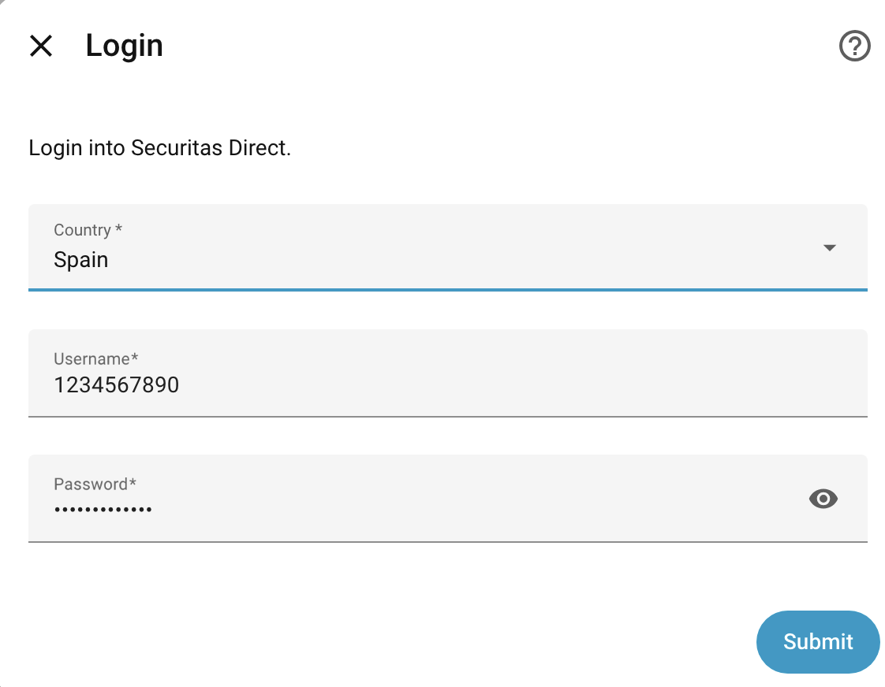
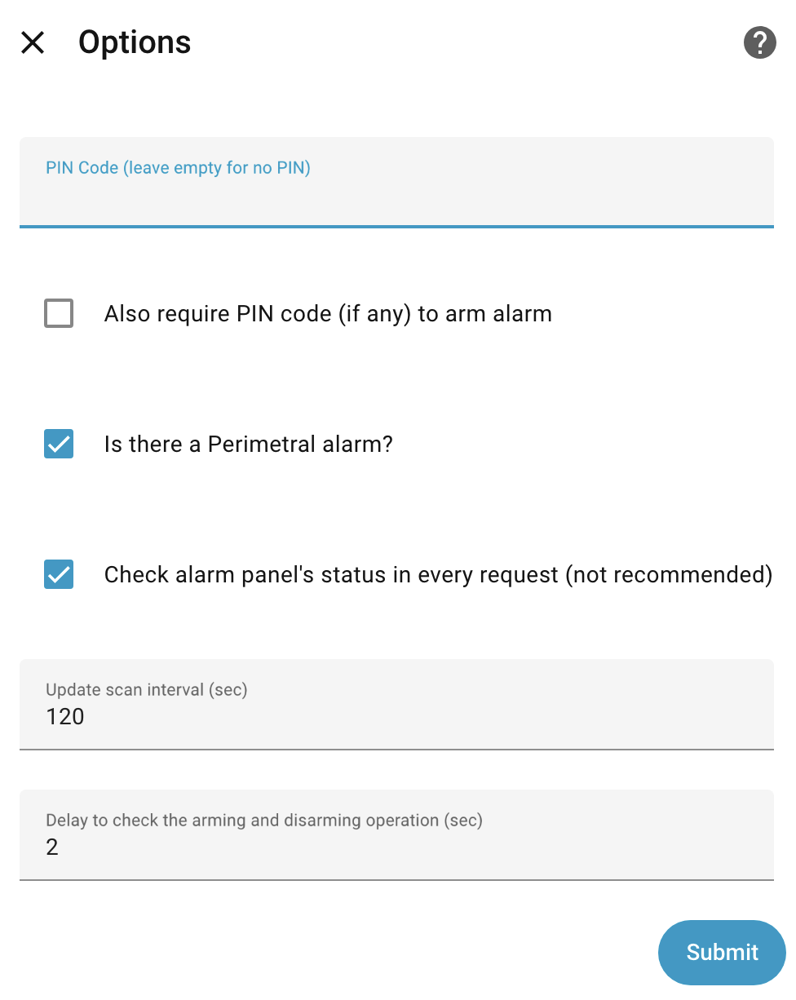

# securitas-direct-new-api
This repository contains the new securitas direct API that can be integrated in Home Assistant.

## Features

- Lists all your installations and adds a panel into Home Assistant.
- Supports Sentinel and adds temperature and humidity sensors for each Sentinel in each installation you have.
- Supports installations with Perimetral (external) alarms.

## Installation

### HACS

Securitas Direct API is available in the [Home Assistant Community Store](https://hacs.xyz/) (HACS).

If you already have HACKS installed, use this link to directly go to the repository in HACS

_or_

1. If you don't have it already, [install HACS](https://www.hacs.xyz/docs/use/download/download/)
2. Open the HACS dashboard in Home Assistant
3. Search for <kbd>Securitas Direct Alarm</kbd>
4. Select that entry and click the download button. ⬇️

## Setup

This integration supports config flow, so go to the list of integrations and click on add Securitas from there.

- Enter the username and password for your Securitas account.
- Use 2FA (default: yes). Uncheck this box if you want to skip the 2FA. 
- Country Code. One of BR (Brasil), CL (Chile), ES (Spain), FR (France), GB (Great Britain), IE (Ireland), IT (Italy) and AR (Argentine). If you are outside of those countries, try entering "default" and if that doesn't work open an issue to see if we can expand.
- PIN code (optional). If you set a PIN here, you will need to enter it to arm or disarm the alarm using the Home Assistant panel. This PIN is independent of Securitas. It is never sent to Securitas and it has nothing to do with your account with them.
- Perimetral alarm (default: no). If you have sensors outside of your home, check the box. Otherwise, leave the box unchecked. This will ensure that the integration sends the correct commands to arm the alarm.
- Check alarm panel (default: yes). The integration checks periodically the status of the alarm (see next option). If this Option is On, the integration will check the alarm status in the alarm in your home and HA will reflect the alarm's status. This will result in the requests showing in your account and there are reports of users saying that Securitas calls them to ask about these requests. If this option is Off, the integration will check the last status that Securitas have in their server instead of checking in the alarm itself. This will decrease the number of request that show in your account. But if you arm or disarm the alarm using the Securitas app, the alarm in Home Assistant will likely show a different state.
- Update scan interval (default: 120). How often the integration checks the status of the alarm.

## Options
If you need to change some of the options, you can configure the integration (in HA, go to Settings -> Integrations -> Securitas Direct -> Configure)

## New Features

Added a button to update the status of your alamr using the API. Thanks to @edwin-anne.

## Breaking changes

If you update the component, the domain has been changed from securitas_direct to securitas, so you need to change your configuration as well or Home Assistant will not find the integration.
