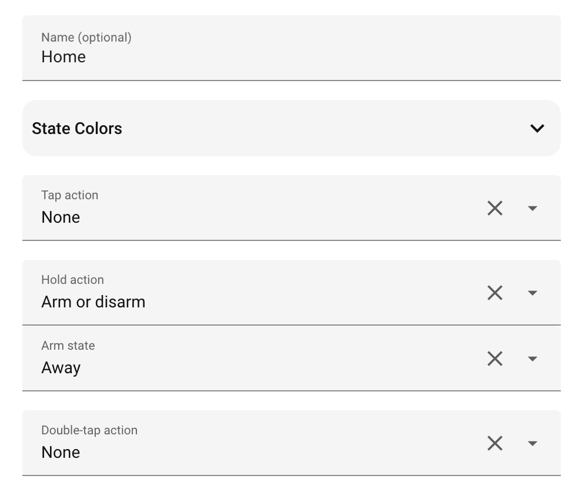
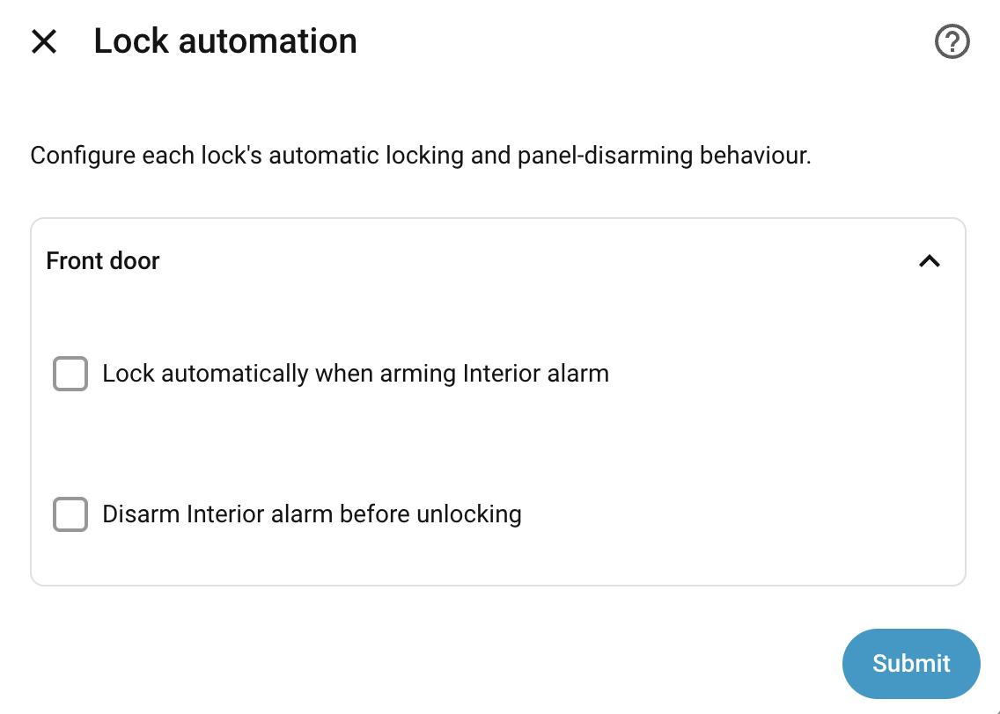
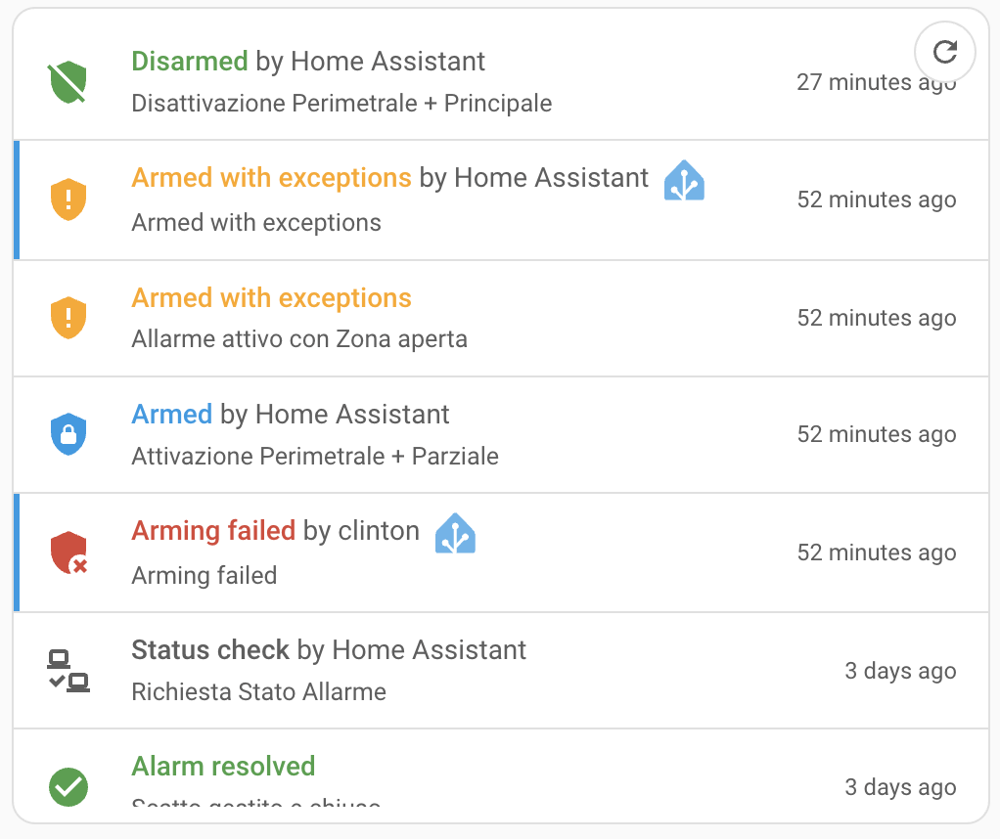

# Verisure OWA

A Home Assistant custom integration for **Verisure** (formerly Securitas Direct in some markets), supporting Argentina, Brazil, Chile, France, Ireland, Italy, Peru, Portugal, Spain, and the United Kingdom.

> **Upgrading from a previous version?** See [CHANGES.md](./CHANGES.md) for what's new and the breaking changes in this release.

## Features

### Alarm control

- **Main panel** — arm, disarm, and monitor your alarm from HA, one per installation.
- **Configurable mappings** — choose which Verisure mode each HA button (Home, Away, Night, Vacation, Custom) activates.
- **Per-axis sub-panels** — optional Interior-only, Perimeter-only, and Annex-only panels alongside the main one, for installations with the corresponding sensors.
- **Force arming** — when arming is blocked by an open sensor, you can force-arm from a mobile notification, the custom alarm card, an automation, or the `verisure_owa.force_arm` service.
- **Refresh button** — request an immediate alarm status check.

### Lovelace cards

Custom cards bundled with the integration:

- **Alarm card** — dynamic arm buttons (only the modes you've mapped), PIN keypad, and force-arm UI.
- **Alarm badge** — compact dashboard badge with a state-specific shield icon; tap opens the alarm card, hold/double-tap can arm or disarm directly.
- **Mushroom chip** — pill-shaped chip for use inside a [Mushroom Chips Card](https://github.com/piitaya/lovelace-mushroom), with the same state-specific icon and color as the badge.
- **Camera card** — latest thumbnail with a capture button, timestamp overlay, and click-to-open full-resolution image.
- **Activity log card** — viewer for the activity log with a refresh button and click-through to entry details (including images for image-request entries).

### Smart locks

- **Lock, unlock, open** — multiple locks per installation. If your lock supports latch hold-back, an **Open** action is also available.
- **Auto-lock on arm** — pick which circuits should lock the door when they arm.
- **Auto-disarm before unlock** — pick which circuits should be disarmed when the lock is unlocked from HA. The disarm and the unlock dispatch in parallel.
- **Failure notifications** — persistent notifications when an auto-lock, auto-disarm, or post-disarm unlock fails.

### Cameras

- **Live thumbnails + full-resolution images** — one thumbnail entity and one full-resolution entity per camera.
- **On-demand capture** — a Capture button triggers a fresh image; a `capturing` attribute is exposed for automations.

### Sensors

- **Sentinel** — temperature, humidity, and air quality (numeric and categorical) for each Sentinel device.
- **WiFi connectivity** — diagnostic binary sensor showing the panel's connection status.
- **Activity log sensor** — the most recent Verisure event as state, with the last 30 entries available as an attribute.

### Activity log

- **Verisure event history in HA** — arm/disarm, the Verisure user who did it, intrusions, image requests, power cuts, and more — surfaced via: an activity log card, the activity log sensor, and a `verisure_owa_activity` event you can trigger automations on.
- **HA action enrichment** — actions taken from within Home Assistant are tagged with the actual HA user and replace the events coming from Verisure so that automations only fire once.

### Multi-installation & authentication

- **Multiple installations per account** — each installation gets its own entities; the API session is shared.
- **Two-factor authentication** — handled automatically via SMS during setup if your account needs it.
- **No password on disk** — your password is used once to mint a long-lived refresh token, then discarded. If the token is revoked or expires, HA shows a reauth dialog.
- **Local PIN protection** — optional PIN for arming and/or disarming from HA, separate from your Verisure account.

## Supported Countries

| Code | Country       | 
| ---- | ------------- | 
| AR   | Argentina     | 
| BR   | Brazil        | 
| CL   | Chile         | 
| ES   | Spain         | 
| FR   | France        | 
| GB   | United Kingdom| 
| IE   | Ireland       | 
| IT   | Italy         | 
| PE   | Peru          | 
| PT   | Portugal      | 

## Installation

### HACS (recommended)

[](https://my.home-assistant.io/redirect/hacs_repository/?owner=guerrerotook&repository=securitas-direct-new-api)

Or manually:

1. [Install HACS](https://www.hacs.xyz/docs/use/download/download/) if you don't have it already.
2. Open the HACS dashboard in Home Assistant.
3. Search for **Verisure OWA**.
4. Click download.

## Setup

Go to **Settings → Integrations → Add Integration** and search for **Verisure OWA**.


The wizard takes you through:

1. **Login** — your country (auto-detected from your HA locale), username, and password. If your account requires 2FA you'll be asked to pick a phone number and enter the SMS code.
2. **Installation** — if your account has more than one, pick which to configure. Repeat the flow to add others. Perimeter and annex sensors are detected automatically.
3. **Options** — PIN code, force-arm notifications, optional sub-panel toggles, and a collapsed Advanced section.
4. **Mappings** — map each HA alarm button (Home, Away, Night, Vacation, Custom) to a Verisure mode.

Locks and cameras are discovered in the background after setup. The **Lock automation** screen for auto-lock and auto-disarm appears under **Configure** once locks are registered.

Your password is not stored. After login the integration keeps a long-lived refresh token in the config entry; if it expires or is revoked (e.g. you change your password elsewhere), HA shows a reauth dialog and entering the password once mints a new token.

## Options

After setup, change settings via **Settings → Integrations → Verisure OWA → Configure**. The dialog walks you through three screens — or four if you have locks: a settings page, the [alarm state mappings](#alarm-state-mappings), and (when locks are present) the [lock automation](#lock-automations) page.


### Settings

| Section | Option | Default | Description |
| ------- | ------ | ------- | ----------- |
| **PIN code for disarming** | PIN code | _(empty)_ | Optional local PIN for the HA alarm panel. This PIN is **not** sent to Verisure — it only protects the panel in Home Assistant. Numeric or alphanumeric. |
| | Require PIN to arm | No | When enabled, the PIN is also required to arm (not just disarm). No effect if no PIN is set. |
| **Force-arm notifications** | Notify service | _(none)_ | A `notify` service to call when arming is blocked. Pick a mobile app notify service to receive an actionable notification with **Force Arm** and **Cancel** buttons. |
| | Built-in force-arm notifications | Yes | When enabled (default), the integration creates persistent and mobile notifications when arming is blocked. Disable to handle the `verisure_owa_arming_exception` event from your own automations. See [Force Arming (advanced)](#force-arming-advanced). |
| **Additional sub-panels** _(only when supported)_ | Enable Perimeter-only panel | No | Adds a `Perimeter - <alias>` alarm panel that controls the perimeter axis only. Visible only on installations with perimeter sensors. |
| | Enable Annex-only panel | No | Adds an `Annex - <alias>` alarm panel that controls the annex axis only. Visible only on installations with an annex zone. |
| | Enable Interior-only panel | No | Adds an `Interior - <alias>` alarm panel that controls the interior axis only. Visible whenever any sibling axis is supported. |
| **Advanced** _(collapsed)_ | Update scan interval | 120s | How often the integration checks the alarm status. Set to 0 to disable automatic polling. |
| | Delay between API requests | 2s | Minimum gap between consecutive API requests. Higher values reduce the risk of WAF rate limiting. |

## Alarm State Mappings

Verisure supports several alarm modes, but Home Assistant's alarm panel only has five buttons: **Home**, **Away**, **Night**, **Vacation**, and **Custom Bypass**. This integration lets you choose which Verisure mode each button activates.


### Available Modes

| Mode                              | Description                                              |
| --------------------------------- | -------------------------------------------------------- |
| Partial Day                       | Interior sensors armed (daytime)                         |
| Partial Night                     | Interior sensors armed (nighttime)                       |
| Total                             | All interior sensors armed                               |
| Perimeter only                    | External/outdoor sensors only                            |
| Partial Day + Perimeter           | Daytime interior + external sensors                      |
| Partial Night + Perimeter         | Nighttime interior + external sensors                    |
| Total + Perimeter                 | All interior + external sensors                          |
| Annex only                        | Annex armed, main alarm disarmed                         |
| Partial Day + Annex               | Daytime interior + annex                                 |
| Partial Night + Annex             | Nighttime interior + annex                               |
| Total + Annex                     | All interior + annex                                     |
| Perimeter + Annex                 | External sensors + annex                                 |
| Partial Day + Perimeter + Annex   | Daytime interior + external sensors + annex              |
| Partial Night + Perimeter + Annex | Nighttime interior + external sensors + annex            |
| Total + Perimeter + Annex         | All interior + external sensors + annex                  |

The available modes depend on which axes are detected on your installation: standard installations see only the four interior modes; perimeter installations add the four perimeter combinations; annex installations add the four annex combinations; installations with both add the four perimeter+annex combinations on top.

To hide a button from the alarm panel, leave its mapping field blank — clearing the field counts as "not used" and the button won't appear.

> **Note:** Your country may only support a single Partial mode, rather than a Partial Day and a Partial Night. In this case, use just Partial Day.

The mapping is bidirectional: when Verisure reports "Total + Perimeter" and you've mapped that to **Away**, the panel shows Armed Away. Switching between modes (Armed Home → Armed Away + Perimeter → Disarmed, etc.) is worked out for you.

### Defaults

| HA Button | Standard      | Perimeter installs |
| --------- | ------------- | ------------------ |
| Home      | Partial Day   | Partial Day        |
| Away      | Total         | Total + Perimeter  |
| Night     | Partial Night | Partial Night      |
| Custom    | _(blank)_     | Perimeter only     |
| Vacation  | _(blank)_     | _(blank)_          |

### When the panel sits in an unmapped state

If the alarm enters a Verisure state you haven't mapped (e.g. perimeter is armed from a physical keypad but you haven't mapped a HA button to it), the entity shows as **Custom Bypass**. To resolve, add a mapping or enable the relevant capability. To check which status code is being reported, [enable debug logging](#reporting-issues).

## Sub-panels (advanced)

The default setup gives you one alarm panel per installation: `Main - <alias>`, driven by the Home / Away / Night / Vacation / Custom mappings. That works for almost everyone.

If your installation has more than one alarm axis (interior, perimeter, annex), you can opt into a dedicated panel for each axis under **Configure**:

- **Interior-only** (`Interior - <alias>`) — Home / Away / Night / Disarmed.
- **Perimeter-only** (`Perimeter - <alias>`) — Armed Away / Disarmed. Only offered when perimeter sensors are detected.
- **Annex-only** (`Annex - <alias>`) — Armed Away / Disarmed. Only offered when an annex zone is detected.

The Interior toggle appears whenever any sibling axis exists; otherwise the main panel already does the same job. If perimeter or annex isn't detected automatically, [enable debug logging](#reporting-issues) and share the `capability detection for ...` line in a bug report.

If you expose entities to a voice assistant, remember each new sub-panel is a separate entity — exposing all of them to voice tends to make commands ambiguous. A common pattern is to enable all sub-panels for dashboards but expose only the main panel to voice.

## Custom Alarm Card

The custom alarm card (`verisure-owa-alarm-card`) is the default way to interact with the alarm from a dashboard. Unlike the stock HA alarm panel card, it surfaces the force-arm warning and buttons inline when arming is blocked.

|                   Disarmed                   |                   Armed (Home)                   |                   Custom Mapping                    |
| :------------------------------------------: | :----------------------------------------------: | :-------------------------------------------------: |
|  |  |  |

|                PIN Keypad                 |                   Force Arm                    |
| :---------------------------------------: | :--------------------------------------------: |
|  |  |

- **Dynamic arm buttons** — only the modes you've mapped are shown.
- **PIN keypad** — appears automatically when you've configured a PIN. Numeric codes get a numeric keypad; alphanumeric codes get a text input. The keypad on arm only appears if you've enabled "Require PIN to arm".
- **Force-arm UI** — when arming is blocked, the card shows the affected sensors with inline **Force Arm** / **Cancel** buttons.
- **Theme-aware** — works correctly in both light and dark mode.

To add it, click **Add Card → Search for "Verisure OWA Alarm Card"** and pick your alarm panel entity.

### Badge

A compact dashboard badge for the badges row, with a state-specific shield icon (amber warning triangle when arming fails). Tap to open the full alarm card; hold and double-tap can be configured to arm/disarm directly — see [Gesture Actions](#gesture-actions) below.

Add it via **Add Badge → "Verisure OWA Alarm Badge"** and pick your alarm panel entity.

### Mushroom Chip

For a [Mushroom Chips Card](https://github.com/piitaya/lovelace-mushroom), use `type: verisure-owa-alarm`. Same icon and colors as the badge in a Mushroom-compatible pill. Tap opens the alarm card; hold and double-tap are configured in YAML — see [Gesture Actions](#gesture-actions) below.

```yaml
type: custom:mushroom-chips-card
chips:
  - type: verisure-owa-alarm
    entity: alarm_control_panel.my_alarm
```

### Gesture Actions

The **alarm card**, **badge**, and **chip** all support configurable tap, hold, and double-tap actions. For the **card** and **badge**, these can be set in the visual editor under the **Tap action**, **Hold action**, and **Double-tap action** sections. For the **chip**, these actions are configured in YAML (see [below](#chip-gesture-actions)).



| Action     | Badge default | Chip default    | Card default |
| ---------- | ------------- | --------------- | ------------ |
| Tap        | Open alarm card | Open alarm card | _(none)_   |
| Hold       | Arm / Disarm  | _(none)_        | _(none)_     |
| Double-tap | _(none)_      | _(none)_        | _(none)_     |

Each action can be set to one of the following:

| Option   | Description                                                                                         |
| -------- | --------------------------------------------------------------------------------------------------- |
| None     | Do nothing.                                                                                         |
| Navigate | Navigate to a dashboard path. A path selector appears to choose the destination.                    |
| Arm      | Arm the alarm to a chosen state (Home, Away, Night, Custom, or Vacation). Only fires when disarmed. |
| Disarm   | Disarm the alarm. Only fires when armed.                                                            |

Example: set **Hold** to **Disarm** on the badge to disarm with a long press, without opening the card popup.

The card and badge have a visual editor for gesture actions. The chip only supports YAML configuration:

```yaml
type: custom:mushroom-chips-card
chips:
  - type: verisure-owa-alarm
    entity: alarm_control_panel.my_alarm
    tap_action:
      action: more-info           # default — opens alarm card popup
    hold_action:
      action: arm_or_disarm       # arms when disarmed, disarms when armed
    double_tap_action:
      action: navigate
      navigation_path: /lovelace/security
```

Available actions:

| Action           | YAML value                                                           |
| ---------------- | -------------------------------------------------------------------- |
| None             | `action: none`                                                       |
| Open alarm card  | `action: more-info`                                                  |
| Navigate         | `action: navigate` + `navigation_path: /path`                       |
| Arm or Disarm    | `action: arm_or_disarm` (optionally + `arm_state: armed_away` etc.) |

## Sentinel Sensors

If your installation includes Sentinel devices, the integration automatically creates temperature, humidity, and air quality sensors for each one.

## Smart Locks

Smart door locks become lock entities you can operate from HA — multiple locks per installation, each with its own entity. If your lock supports latch hold-back, the entity also gets an **Open** action that unlatches the door without unlocking it.

### Lock automations

Each lock can be wired up under **Configure → Lock automation** with two optional behaviours:



- **Auto-lock on arm** — pick which circuits should lock the door when they arm. Tick **Interior** and arming Interior anywhere — main panel, Interior sub-panel, the Verisure app, the physical panel — locks the door.
- **Auto-disarm on unlock** — pick which circuits should be disarmed when the lock is unlocked from HA. The disarm and the unlock dispatch in parallel, so both finish in roughly the time of one, and your sub-panels animate the disarm in the meantime.

Auto-disarm only fires when the unlock comes from inside HA. Unlocking from the Verisure app or the physical lock doesn't disarm anything.

When something goes wrong, you get a persistent notification:

| Notification | When it fires |
| ------------ | ------------- |
| **Auto-lock failed** | The auto-lock fired but the lock couldn't reach the locked state. |
| **Auto-disarm failed** | The pre-unlock disarm didn't disarm the configured circuits. The unlock still proceeds. |
| **Unlock failed** | The disarm succeeded but the lock didn't unlock — the alarm is now disarmed but the door is still locked. |

## Cameras

Each Verisure camera produces two entities — `camera.<name>` for the thumbnail and `camera.<name>_full_image` for the full-resolution image — plus a **Capture** button to request a fresh shot. The thumbnail entity exposes a `capturing` attribute (true while a request is in flight) so dashboards and automations can react to it.

Captures can take up to 30 seconds to appear, depending on how busy the API is.

### Custom Camera Card

There's a custom camera card (`verisure-owa-camera-card`) tailored to the Verisure camera entities.


It shows the latest thumbnail image with:

- **Capture button** — shown in the top-right corner, requests a new photograph
- **Timestamp overlay** — displays when the image was taken, with a relative time and an absolute tooltip
- **Click to open** — clicking the image opens the HA more-info dialog. If a full-resolution image is available (auto-discovered from the same device), it opens the full-resolution entity; otherwise the thumbnail entity.

To add it to your dashboard, click **Add Card → Search for "Verisure OWA Camera Card"** and pick your camera entity from the dropdown.

```yaml
type: custom:verisure-owa-camera-card
entity: camera.sala              # thumbnail entity (required)
name: Sala                       # optional — overrides the entity friendly name
```

| Option | Required | Description |
|---|---|---|
| `entity` | Yes | The thumbnail camera entity (`camera.<name>`) |
| `name` | No | Display name shown on the card. Defaults to the HA device name. |

## Activity Log

The Activity Log mirrors the history shown in the Verisure app: arm/disarm events, who did them, intrusions, image requests, power cuts, and more.



The integration surfaces this history in three places:

- **A Lovelace card** — Add Card → "Verisure OWA Activity Log Card". Click any row for details (including images for image-request entries); the refresh button is top-right.
- **A sensor** — `sensor.<alias>_activity_log` exposes the most recent event as state, with the last 30 entries in its `events` attribute for templates and custom cards.
- **The event bus** — each new entry fires a `verisure_owa_activity` event you can trigger automations on.

Each entry carries a **category** — a stable label for the type of event. The full list:

`armed`, `armed_with_exceptions`, `arming_failed`, `disarmed`, `alarm`, `alarm_resolved`, `tampering`, `sabotage`, `image_request`, `power_cut`, `power_restored`, `status_check`, `communication_failed`, `unknown`.

### Activity events vs the alarm panel entity

For automations, you have two natural triggers to choose from. Use the **alarm panel entity** (`alarm_control_panel.<alias>`) when you only care about the current armed/disarmed state — "turn the lights off when armed", "notify me when triggered", that kind of thing. Reach for **activity events** when you need who did it, what zones were involved, or for events the panel state doesn't reflect at all (tampering, sabotage, image requests, power cuts).

If both would work, the panel entity is simpler.

### Triggering automations on activity events

Trigger on a category and you'll catch every event of that kind:

```yaml
trigger:
  - platform: event
    event_type: verisure_owa_activity
    event_data:
      category: disarmed
```

Useful fields on `trigger.event.data`:

| Field | What it tells you |
| ----- | ----------------- |
| `category` | The stable label above (always present). |
| `alias` | The panel's own description, in your panel's language. |
| `verisure_user` | The Verisure account name that performed the action, if any. |
| `injected` | `true` if this event came from a Home Assistant action (see below). |

#### "Who disarmed it?" example

```yaml
trigger:
  - platform: event
    event_type: verisure_owa_activity
    event_data:
      category: disarmed
action:
  - service: notify.mobile_app
    data:
      message: "Alarm disarmed by {{ trigger.event.data.verisure_user or 'someone at the panel' }}"
```

#### Home Assistant actions and the `injected` flag

When you arm, disarm, or request an image **from Home Assistant** (the card, an automation, the alarm panel entity, a service call), the integration writes an enriched event into the log immediately — tagged with the actual HA user, any arming exceptions, and the captured image where applicable. These entries show a small Home Assistant badge in the card and have `injected: true`.

The matching event polled back from the panel ~60 seconds later is suppressed: it doesn't appear in the log and it doesn't fire on the event bus, so your automations only run once per action.

If you specifically want to react **only** to actions taken outside Home Assistant (at the panel, in the Verisure app, etc.), exclude the injected entries with a template condition:

```yaml
condition:
  - condition: template
    value_template: "{{ not trigger.event.data.injected }}"
```

### Help us improve coverage

Two things to keep an eye out for and [open an issue](https://github.com/guerrerotook/securitas-direct-new-api/issues) about:

- **Unknown event rows.** If a row shows up as "Unknown event", the panel sent a code we haven't catalogued. Click the row to expand it — there's a prompt asking for a screenshot. Send that along with a note about what triggered it (a manual disarm, an alarm test, etc.).
- **Missing HA enrichment.** If you arm, disarm, force-arm, or take an image from HA and the log shows a plain row (no HA badge, no user name) instead of an enriched one, we don't yet inject for that category. Tell us what you did and what showed up.

## Automations & Scripts

You can arm, disarm, and control the alarm from automations and scripts using the standard Home Assistant alarm actions:

```yaml
action: alarm_control_panel.alarm_arm_away
target:
  entity_id: alarm_control_panel.my_alarm
data:
  code: "12345" # only needed if you have a PIN configured
```

Replace `alarm_arm_away` with the action for the mode you want:

| Action                                        | Mode     |
| --------------------------------------------- | -------- |
| `alarm_control_panel.alarm_arm_away`          | Away     |
| `alarm_control_panel.alarm_arm_home`          | Home     |
| `alarm_control_panel.alarm_arm_night`         | Night    |
| `alarm_control_panel.alarm_arm_vacation`      | Vacation |
| `alarm_control_panel.alarm_arm_custom_bypass` | Custom   |
| `alarm_control_panel.alarm_disarm`            | Disarm   |

> **Important:** Only actions for modes you have mapped in the [Alarm State Mappings](#alarm-state-mappings) will work. If you try to arm with an unmapped mode (e.g. calling `alarm_arm_home` when Home is left blank), the action will fail with an error. Check your mappings in **Settings → Integrations → Verisure OWA → Configure → Submit** (second page).

You can test which actions are available for your alarm in **Settings → Developer Tools → Actions** — type "arm alarm" to see the list.

## Force Arming (advanced)

Most users won't need anything from this section. When arming is blocked by an open sensor, the [custom alarm card](#custom-alarm-card) shows a warning with a **Force Arm** button, and — if **Built-in force-arm notifications** is enabled in the integration options — a mobile notification with **Force Arm** / **Cancel** action buttons does the same from your phone. That covers the common "window left open" case with no automation work.

The rest of this section is for users who want something more advanced: writing their own automations against the `verisure_owa_arming_exception` event (e.g. auto-force-arm only on `armed_away`, custom notification text, multi-step logic), or calling the `verisure_owa.force_arm` service directly.

### What happens when arming is blocked

The arm command reverts, the entity gains `force_arm_available` and `arm_exceptions` attributes, and a `verisure_owa_arming_exception` event fires (always — regardless of the notifications toggle). The card shows a warning with **Force Arm** / **Cancel** buttons. If built-in notifications are enabled, you also get a persistent notification and (when a notify service is configured) a mobile notification with the same buttons.

You then have ~180 seconds to either fix the underlying issue and arm normally, or force-arm — from the card, the mobile notification, the `verisure_owa.force_arm` service targeting your alarm panel entity, or your own automation. After 180 seconds the force-arm context expires and you have to retry from scratch.

### The `verisure_owa_arming_exception` event

| Field | What it tells you |
| ----- | ----------------- |
| `entity_id` | The alarm panel entity that failed to arm. |
| `mode` | The HA state that was attempted (`armed_away`, `armed_home`, …). |
| `zones` | Open zone names, e.g. `["Kitchen window", "Bedroom sensor"]`. |
| `details.installation` | The Verisure installation number. |
| `details.exceptions` | Full exception list from the API (`alias`, `zone_id`, `device_type`). |

### Writing your own automations

Disable **Built-in force-arm notifications** in the integration options, then trigger on the event. The most common pattern is to auto-force-arm only when the user picks Away (because at that point they've left the building):

```yaml
- alias: "Alarm: auto force-arm when leaving"
  triggers:
    - trigger: event
      event_type: verisure_owa_arming_exception
  conditions:
    - condition: template
      value_template: "{{ trigger.event.data.mode == 'armed_away' }}"
  actions:
    - action: verisure_owa.force_arm
      target:
        entity_id: "{{ trigger.event.data.entity_id }}"
```

The `zones` field on the event makes it easy to send a custom notification with the open zone names, or to branch by mode (force-arm Away, only notify on Night, etc.).

### Notifying multiple people

The **Notify service** field accepts a single service name. To notify several people, create a notify group in `configuration.yaml`:

```yaml
notify:
  - platform: group
    name: Mobiles
    services:
      - service: mobile_app_your_phone
      - service: mobile_app_partner_phone
```

After a restart, `notify.mobiles` shows up in the dropdown. The action buttons in the notification are scoped to the installation, so any household member who taps **Force Arm** or **Cancel** triggers the right action.

## Troubleshooting

- **HTTP 403 errors / rate limiting** — Verisure uses a web application firewall (WAF) that blocks requests if you poll too frequently. The integration retries once automatically, but if you see repeated 403 errors in the logs:
  - **Increase the update interval** — Go to **Settings → Integrations → Verisure OWA → Configure**, expand the **Advanced** section, and increase the **Update scan interval** (default: 120 seconds). Try 180 or 300 seconds.
  - **Increase the API request delay** — The **Delay between API requests** (default: 2 seconds) controls the minimum gap between consecutive API calls. Increasing this to 4–5 seconds reduces request bursts.
  - If you have **multiple installations** on one account, each one polls independently, multiplying the request rate. All API requests to the same country domain are serialized through a shared queue, which helps, but the total volume still increases with each installation.
- **Alarm shows wrong state after using the Verisure app** — Periodic polling reads the last known status from the Verisure server, which may take a moment to reflect changes made via the app. Press the **Refresh** button to force an immediate panel check.
- **Stale lock state after lock/unlock** — If the lock shows the old state after a lock or unlock command and only self-corrects after the next periodic poll (~2 minutes), please [open an issue](https://github.com/guerrerotook/securitas-direct-new-api/issues) with your debug logs. We are actively improving lock status polling and your logs will help.
- **Cannot clear PIN code** — In the options flow, clear the PIN field and save. The PIN will be removed.
- **2FA issues** — If 2FA fails, remove and re-add the integration. You will be prompted for a new SMS code. If the error persists, try creating a new user via the Verisure mobile app, then log in to the customer web portal for your country to accept the terms of use before using the new credentials in Home Assistant.

## Reporting Issues

If you encounter a bug or unexpected behavior, please [open an issue](https://github.com/guerrerotook/securitas-direct-new-api/issues) and include the following:

1. **Home Assistant version** and **integration version** (from Settings → Integrations → Verisure OWA).
2. **Country code** you are using.
3. **Debug logs** — enable debug logging from the UI: go to **Settings → Integrations → Verisure OWA**, click the three-dot menu, and select **Enable debug logging**. Reproduce the issue, then click **Disable debug logging** to download the log file.

   If you need debug logs **before the integration has been set up** (e.g. during initial installation), run this action from **Settings → Developer Tools → Actions**:

   ```yaml
   action: logger.set_level
   data:
     custom_components.verisure_owa: debug
   ```

   Then retrieve the logs from **Settings → System → Logs → three dots in the top right corner → Show full logs**.
4. **Steps to reproduce** — what you did, what you expected, and what happened instead.
5. If the issue is about an **unmapped alarm state**, include the `protomResponse` code shown in the Verisure OWA integration log messages (after enabling debug logging and reproducing the issue).

### HAR file (for tricky bugs)

For protocol-level bugs — wrong alarm state, lock or camera misbehaving — a HAR capture of the requests the Verisure website makes is often the fastest way to a fix. Log in to your country's [Verisure customer site](https://customers.securitasdirect.es/owa-static/login), open the browser's **Developer Tools → Network** tab with **Preserve log** ticked and **graphql** in the filter, perform the action that's broken, then save the network log as HAR.


> **Warning:** HAR files can contain credentials or session tokens. Either redact them (it's plain JSON) or email it to one of the maintainers directly.

The same technique is used to [capture payloads for new operations](./docs/new_operations.md) if you'd like to help add support.

