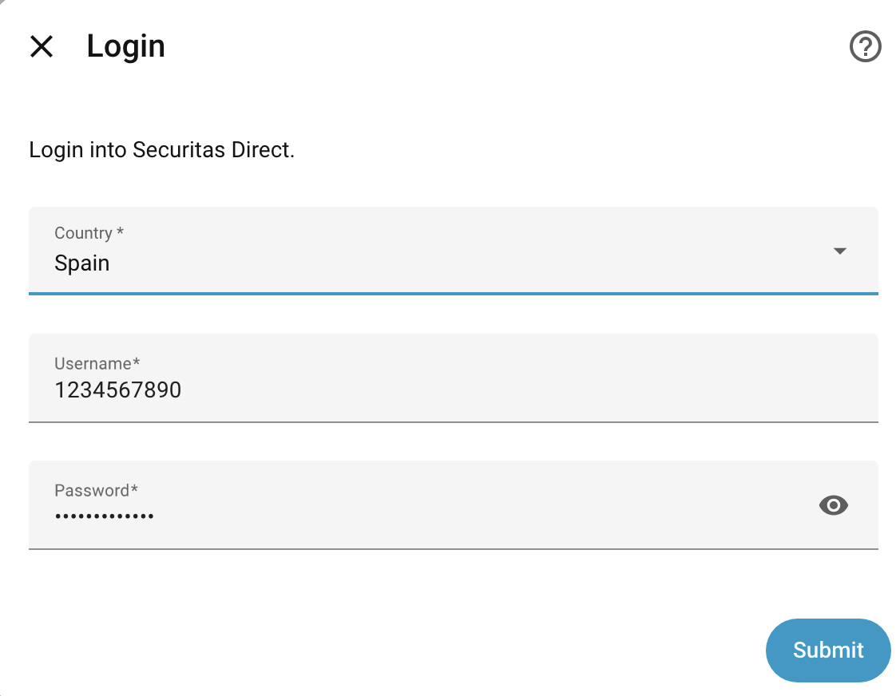
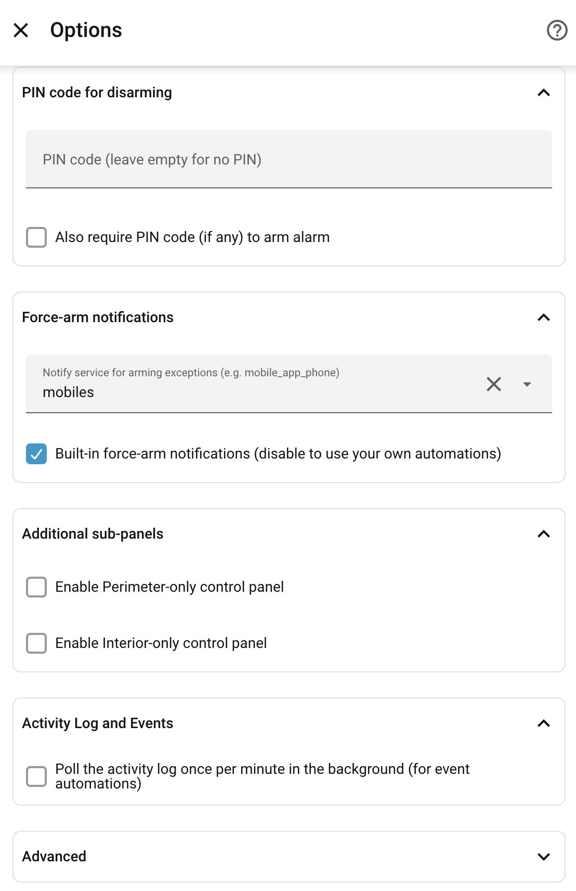
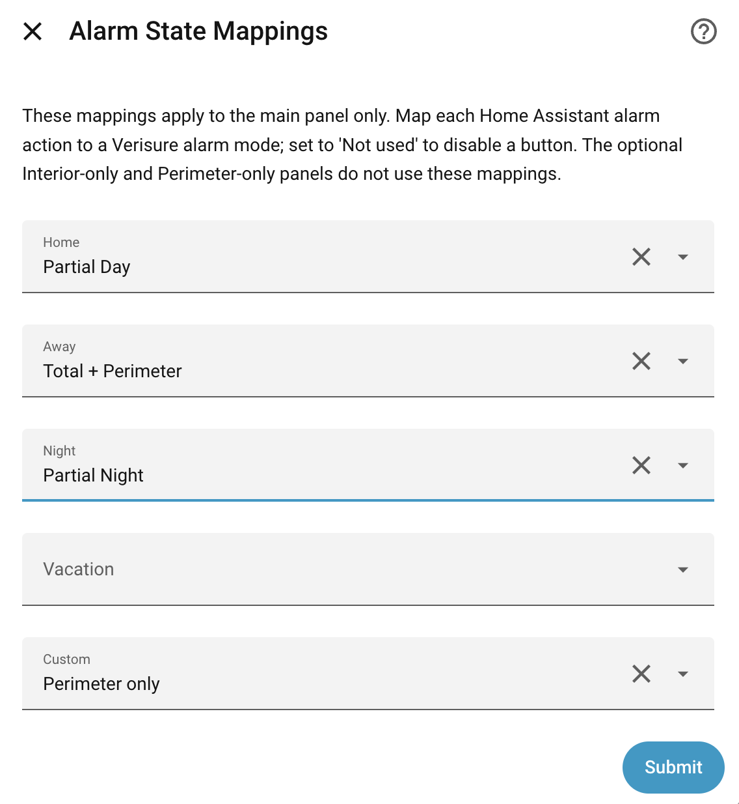

# Securitas Direct Alarm

A Home Assistant custom integration for [Securitas Direct](https://www.securitasdirect.es/) (also known as Verisure in some countries).

## Features

- **Alarm control panel** — arm, disarm, and monitor your alarm from Home Assistant.
- **Configurable alarm state mappings** — map each HA alarm button (Home, Away, Night, Custom) to any Securitas alarm mode.
- **Perimeter alarm support** — full support for installations with external/outdoor sensors.
- **Sentinel sensors** — temperature, humidity, and air quality sensors for each Sentinel device.
- **Smart locks** — lock and unlock smart door locks.
- **Refresh button** — manually trigger an alarm status check.
- **PIN code protection** — optional local PIN code for arming and/or disarming the alarm from Home Assistant (independent of your Securitas account).
- **Two-factor authentication** — login via SMS verification code.

## Supported Countries

| Code | Country     | Brand            |
| ---- | ----------- | ---------------- |
| AR   | Argentina   | Verisure         |
| BR   | Brazil      | Verisure         |
| CL   | Chile       | Verisure         |
| ES   | Spain       | Securitas Direct |
| FR   | France      | Securitas Direct |
| GB   | Great Britain | Verisure       |
| IE   | Ireland     | Verisure         |
| IT   | Italy       | Verisure         |
| PT   | Portugal    | Verisure         |

If your country is not listed, try `default`. If that doesn't work, [open an issue](https://github.com/guerrerotook/securitas-direct-new-api/issues).

## Installation

### HACS (recommended)

Or manually:

1. [Install HACS](https://www.hacs.xyz/docs/use/download/download/) if you don't have it already.
2. Open the HACS dashboard in Home Assistant.
3. Search for **Securitas Direct Alarm**.
4. Click download.

## Setup

Go to **Settings → Integrations → Add Integration** and search for **Securitas Direct**.

| Option | Default | Description |
| ------ | ------- | ----------- |
| Username | — | Your Securitas Direct account username. |
| Password | — | Your Securitas Direct account password. |
| Use 2FA | Yes | Enable two-factor authentication via SMS. Uncheck to skip. |
| Country Code | ES | Your country code (see table above). |
| PIN Code | _(empty)_ | Optional local PIN for the HA alarm panel. This PIN is **not** sent to Securitas — it only protects the panel in Home Assistant. Can be numeric or alphanumeric. Leave empty for no PIN. |
| Require PIN to arm | No | When enabled, the PIN is also required to arm the alarm (not just to disarm). Useful to disable for Android Auto and similar interfaces. Has no effect if no PIN is set. |
| Perimetral alarm | No | Enable if your installation has external/outdoor sensors. This determines which alarm modes are available and the correct disarm command. |
| Check alarm panel | Yes | When enabled, the integration queries the physical alarm panel for its status. When disabled, it reads the last known status from the Securitas server (fewer requests, but may be out of sync if you use the Securitas app). |
| Update interval | 120s | How often (in seconds) the integration checks the alarm status. |

### Two-factor authentication

If 2FA is enabled (the default), you will be asked to select a phone number and enter the SMS code during setup.

## Options

After setup, you can change most settings via **Settings → Integrations → Securitas Direct → Configure**.

## Alarm State Mappings

Securitas Direct supports several alarm modes, but Home Assistant's alarm panel only has four buttons: **Home**, **Away**, **Night**, and **Custom Bypass**. This integration lets you choose which Securitas mode each button activates.

### Available Modes

| Mode                      | Description                           |
| ------------------------- | ------------------------------------- |
| Partial Day               | Interior sensors armed (daytime)      |
| Partial Night             | Interior sensors armed (nighttime)    |
| Total                     | All interior sensors armed            |
| Perimeter Only            | External/outdoor sensors only         |
| Partial Day + Perimeter   | Daytime interior + external sensors   |
| Partial Night + Perimeter | Nighttime interior + external sensors |
| Total + Perimeter         | All interior + external sensors       |
| Not Used                  | Hides the button from the alarm panel |

The available modes depend on whether **Perimetral alarm** is enabled. Standard installations only see the non-perimeter modes; perimeter installations see all modes.

> **Note:** Your country may only support a single Partial mode, rather than a Partial Day and a Partial Night. In this case, use just Partial Day.

### How It Works

Each of the four HA alarm buttons can be mapped to any Securitas mode in the integration options. Set a button to "Not Used" to hide it from the alarm panel.

When the integration checks the alarm status, it translates the Securitas response back to the correct HA state using the same mapping. For example, if you mapped **Away** to "Total + Perimeter", then when Securitas reports "Total + Perimeter" the alarm panel will show "Armed Away".

When switching between armed modes (e.g. from "Armed Home" to "Armed Away"), the integration automatically disarms the alarm first and then arms with the new mode. This is necessary because the Securitas API treats interior and perimeter as independent axes.

### Default Mappings

**Standard installations** (no perimeter sensors):

| HA Button | Securitas Mode    |
| --------- | ----------------- |
| Home      | Partial Day       |
| Away      | Total             |
| Night     | Partial Night     |
| Custom    | Not Used (hidden) |

**Perimeter installations** (external sensors enabled):

| HA Button | Securitas Mode            |
| --------- | ------------------------- |
| Home      | Partial Day               |
| Away      | Total + Perimeter         |
| Night     | Partial Night + Perimeter |
| Custom    | Perimeter Only            |

### Unmapped Alarm States

If your alarm is put into a Securitas state that you have not mapped to any HA button (e.g. the perimeter is armed via a physical panel but perimeter support is not enabled in the integration), the alarm entity will show as **Custom Bypass**. This is not an error — enable perimeter support or adjust your alarm state mappings in the integration options to resolve it.

To see which status code the alarm is reporting, [enable debug logging](#reporting-issues).

## Sentinel Sensors

If your installation includes Sentinel devices, the integration automatically creates temperature, humidity, and air quality sensors for each one.

## Smart Locks

If your installation includes smart door locks, the integration creates lock entities that you can lock and unlock from Home Assistant.

## Troubleshooting

- **Securitas calls about suspicious activity** — If you have **Check alarm panel** enabled, Securitas may notice the periodic status checks in your account. You can disable this option to use server-side status instead (less accurate but fewer requests).
- **Alarm shows wrong state after using the Securitas app** — This happens when **Check alarm panel** is disabled. The integration only sees the last server-side status, which may not reflect changes made via the app.
- **Cannot clear PIN code** — In the options flow, clear the PIN field and save. The PIN will be removed.
- **2FA issues** — If 2FA fails, remove and re-add the integration. You will be prompted for a new SMS code.

## Reporting Issues

If you encounter a bug or unexpected behavior, please [open an issue](https://github.com/guerrerotook/securitas-direct-new-api/issues) and include the following:

1. **Home Assistant version** and **integration version** (from Settings → Integrations → Securitas Direct).
2. **Country code** you are using.
3. **Debug logs** — enable debug logging from the UI: go to **Settings → Integrations → Securitas Direct**, click the three-dot menu, and select **Enable debug logging**. Reproduce the issue, then click **Disable debug logging** to download the log file.
4. **Steps to reproduce** — what you did, what you expected, and what happened instead.
5. If the issue is about an **unmapped alarm state**, include the `protomResponse` code shown in the Securitas Direct integration log messages (after enabling debug logging and reproducing the issue).
