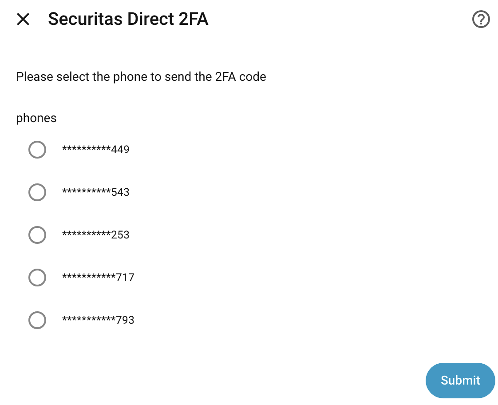
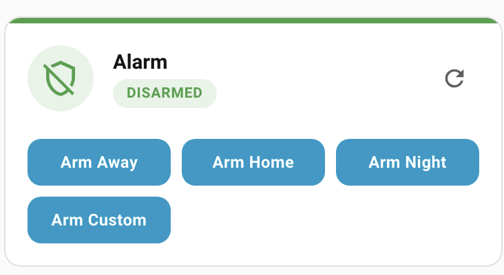
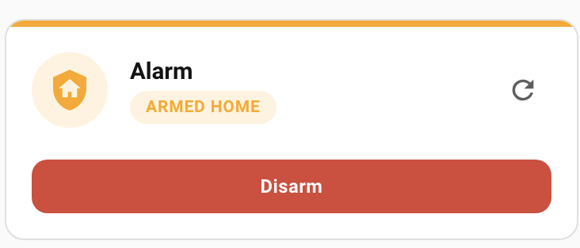
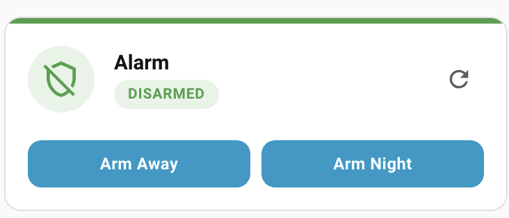
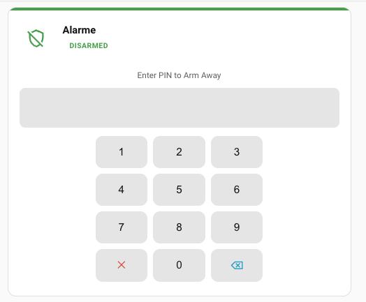
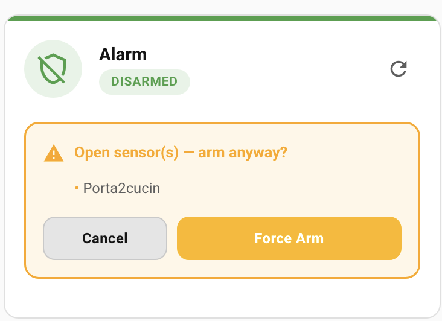
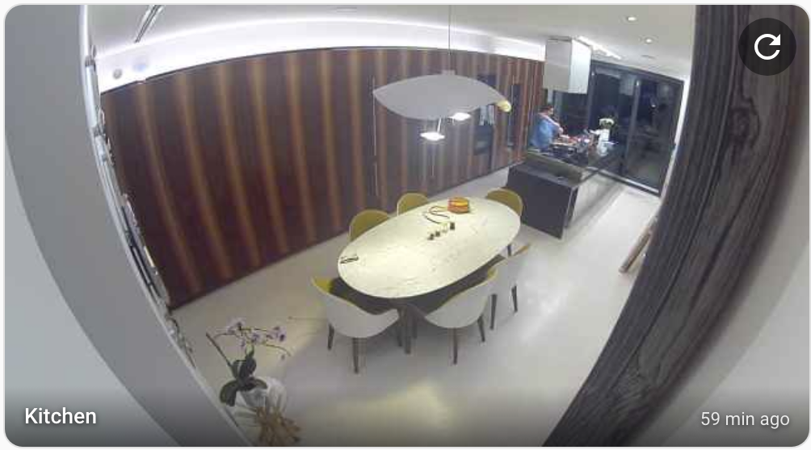

# Securitas Direct Alarm

A Home Assistant custom integration for [Securitas Direct](https://www.securitasdirect.es/) (also known as Verisure in some countries).

## Features

- **Multiple installations** — accounts with multiple installations (e.g. home + office) are fully supported. Each installation gets its own config entry and entities, with a shared API session to minimize login requests.
- **Alarm control panel** — arm, disarm, and monitor your alarm from Home Assistant.
- **Configurable alarm state mappings** — map each HA alarm button (Home, Away, Night, Vacation, Custom) to any Securitas alarm mode.
- **Force arming** — when arming is blocked by an exception (e.g. an open window), the integration notifies you and lets you force-arm via mobile notification, the `securitas.force_arm` service, or the custom alarm card.
- **Custom alarm card** — a purpose-built Lovelace card with dynamic arm buttons, PIN keypad, and built-in force-arm UI.
- **Refresh button** — manually trigger an alarm status check.
- **Perimeter alarm support** — full support for installations with external/outdoor sensors.
- **Sentinel sensors** — temperature, humidity, and air quality sensors for each Sentinel device.
- **Smart locks** — lock and unlock smart door locks. Multiple locks per installation supported, including Danalock configuration attributes (battery, auto-lock, arm-lock policies).
- **Cameras** — view the latest captured image from Securitas cameras, with a capture button to request new images on demand, and a custom camera card for easy display
- **Custom camera card** — a purpose-built Lovelace card to show photographs from the cameras with a refresh button to request a new photograph
- **PIN code protection** — optional local PIN code for arming and/or disarming the alarm from Home Assistant (independent of your Securitas account).
- **Two-factor authentication** — login via SMS verification code.

## Breaking Changes in v4.0.0

> **Warning:** This release includes breaking changes. Please read before upgrading.

**You will need to delete your existing installations and to re-add them after upgrading.**

- **Entity IDs** have changed. Locks and cameras are listed as sub-devices alongside the alarm control panel, and sensors and are now listed as entities under the installation, rather than as top-level devices.
- **"Check alarm panel" option removed** — The integration now always uses the lightweight server-side status check for periodic polling. The more expensive panel query is still used for arm/disarm operations and the manual refresh button. If you had automations or scripts referencing this option, they will need to be updated.
- **"Use 2FA" checkbox removed** — 2FA is now handled automatically during setup. If your account requires 2FA, you will be prompted; if not, the step is skipped.
- **Per-installation config entries** — The integration now creates one config entry per installation instead of one per account. If your account has multiple installations, you add each one separately via the setup wizard (which now includes an installation picker step). Accounts with multiple installations previously had all installations bundled into a single config entry — this is no longer supported.
- **Perimeter alarm auto-detection** — The "Perimetral alarm" checkbox has been replaced by automatic detection from the installation's service attributes. Your existing perimeter setting is preserved during migration.
- **Scan interval and API delay moved to Advanced section** — These options are now in a collapsible "Advanced" section in the options flow. The "Delay to check arming and disarming operations" has been renamed to "Delay between API requests" and now applies to all API calls (not just arm/disarm polling).
- **WiFi diagnostic sensor added** — A new `wifi_connected` sensor is created per installation, showing the panel's WiFi connection status.

## Supported Countries

| Code | Country       | Brand            |
| ---- | ------------- | ---------------- |
| AR   | Argentina     | Verisure         |
| BR   | Brazil        | Verisure         |
| CL   | Chile         | Verisure         |
| ES   | Spain         | Securitas Direct |
| FR   | France        | Securitas Direct |
| GB   | Great Britain | Verisure         |
| IE   | Ireland       | Verisure         |
| IT   | Italy         | Verisure         |
| PT   | Portugal      | Verisure         |

If your country is not listed, try `default`. If that doesn't work, [open an issue](https://github.com/guerrerotook/securitas-direct-new-api/issues).

## Installation

### HACS (recommended)

[](https://my.home-assistant.io/redirect/hacs_repository/?owner=guerrerotook&repository=securitas-direct-new-api)

Or manually:

1. [Install HACS](https://www.hacs.xyz/docs/use/download/download/) if you don't have it already.
2. Open the HACS dashboard in Home Assistant.
3. Search for **Securitas Direct Alarm**.
4. Click download.

## Setup

Go to **Settings → Integrations → Add Integration** and search for **Securitas Direct**.

The setup flow is a multi-step wizard:

1. **Login** — Enter your country, username, and password. 2FA is handled automatically if your account requires it.
2. **Installation** — If your account has multiple installations, pick which one to configure. Repeat the setup flow to add additional installations. Perimeter support is auto-detected from the installation's services.
3. **Options** — Set your PIN code, notification service, and optionally expand the **Advanced** section for scan interval and API delay settings.
4. **Mappings** — Map each HA alarm button to a Securitas alarm mode.

### Login


| Option       | Default  | Description                                                                       |
| ------------ | -------- | --------------------------------------------------------------------------------- |
| Username     | —        | Your Securitas Direct account username.                                           |
| Password     | —        | Your Securitas Direct account password.                                           |
| Country Code | _(auto)_ | Auto-detected from your HA locale. All supported countries available in dropdown. |

### Two-factor authentication

If your account requires 2FA, you will automatically be asked to select a phone number and enter the SMS code during setup.



## Options

After setup, you can change most settings via **Settings → Integrations → Securitas Direct → Configure**.


| Option                                  | Default   | Description                                                                                                                                                                            |
| --------------------------------------- | --------- | -------------------------------------------------------------------------------------------------------------------------------------------------------------------------------------- |
| PIN Code                                | _(empty)_ | Optional local PIN for the HA alarm panel. This PIN is **not** sent to Securitas — it only protects the panel in Home Assistant. Can be numeric or alphanumeric.                       |
| Require PIN to arm                      | No        | When enabled, the PIN is also required to arm the alarm (not just to disarm). Has no effect if no PIN is set.                                                                          |
| Notify service                          | _(none)_  | A `notify` service to call when arming is blocked by an exception. Select a mobile app notify service to receive an actionable notification with **Force Arm** and **Cancel** buttons. |
| Update interval _(Advanced)_            | 120s      | How often (in seconds) the integration checks the alarm status. Set to 0 to disable automatic polling.                                                                                 |
| Delay between API requests _(Advanced)_ | 2s        | Minimum delay between consecutive API requests. Higher values reduce the risk of WAF rate limiting.                                                                                    |

## Alarm State Mappings

Securitas Direct supports several alarm modes, but Home Assistant's alarm panel only has five buttons: **Home**, **Away**, **Night**, **Vacation**, and **Custom Bypass**. This integration lets you choose which Securitas mode each button activates.


### Available Modes

| Mode                      | Description                           |
| ------------------------- | ------------------------------------- |
| Partial Day               | Interior sensors armed (daytime)      |
| Partial Night             | Interior sensors armed (nighttime)    |
| Total                     | All interior sensors armed            |
| Perimeter Only            | External/outdoor sensors only         |
| Partial Day + Perimeter   | Daytime interior + external sensors   |
| Partial Night + Perimeter | Nighttime interior + external sensors |
| Total + Perimeter         | All interior + external sensors       |
| Not Used                  | Hides the button from the alarm panel |

The available modes depend on whether a **Perimetral alarm** has been detected. Standard installations only see the non-perimeter modes; perimeter installations see all modes.

> **Note:** Your country may only support a single Partial mode, rather than a Partial Day and a Partial Night. In this case, use just Partial Day.

### How It Works

Each of the five HA alarm buttons can be mapped to any Securitas mode in the integration options. Set a button to "Not Used" to hide it from the alarm panel.

When the integration checks the alarm status, it translates the Securitas response back to the correct HA state using the same mapping. For example, if you mapped **Away** to "Total + Perimeter", then when Securitas reports "Total + Perimeter" the alarm panel will show "Armed Away".

When switching between modes (e.g. from "Armed Home" to "Armed Away + Perimeter" or to "Disarmed"), the integration automatically determines what changes need to be made to match the requested state.

### Default Mappings

**Standard installations** (no perimeter sensors):

| HA Button | Securitas Mode    |
| --------- | ----------------- |
| Home      | Partial Day       |
| Away      | Total             |
| Night     | Partial Night     |
| Custom    | Not Used (hidden) |
| Vacation  | Not Used (hidden) |

**Perimeter installations** (external sensors enabled):

| HA Button | Securitas Mode    |
| --------- | ----------------- |
| Home      | Partial Day       |
| Away      | Total + Perimeter |
| Night     | Partial Night     |
| Custom    | Perimeter Only    |
| Vacation  | Not Used (hidden) |

> **Note:** Perimeter variants (e.g. "Partial Night + Perimeter") are available as options and can be assigned to any button via the integration options.

### Unmapped Alarm States

If your alarm is put into a Securitas state that you have not mapped to any HA button (e.g. the perimeter is armed via a physical panel but perimeter support is not enabled in the integration), the alarm entity will show as **Custom Bypass**. This is not an error — enable perimeter support or adjust your alarm state mappings in the integration options to resolve it.

To see which status code the alarm is reporting, [enable debug logging](#reporting-issues).

## Force Arming

When you arm the alarm and a sensor is in a fault state (e.g. a window is open), Securitas may block the arm and report a non-blocking exception. The integration handles this as follows:

1. The alarm panel reverts to its previous state.
2. The [custom alarm card](#custom-alarm-card) shows a warning listing the problematic sensors, with **Force Arm** and **Cancel** buttons.
3. A **persistent notification** appears in Home Assistant listing the affected sensors.
4. If a **Notify service** is configured, a **mobile notification** is sent with two action buttons: **Force Arm** and **Cancel**.

### Resolving the exception

- **Fix the issue** (close the window, clear the fault) and arm again normally.
- **Force arm** to arm despite the exception. You can do this from:
  - The **Force Arm** button in the mobile notification.
  - The `securitas.force_arm` service, targeted at the alarm panel entity.
  - The **Force Arm** button in the [custom alarm card](#custom-alarm-card).

The force-arm context expires automatically at the next status refresh, so force-arming is only possible immediately after the exception occurs.

### Notifying multiple people

The **Notify service** field accepts a single service name. To notify multiple people at once, create a notify group in your `configuration.yaml`:

```yaml
notify:
  - platform: group
    name: Mobiles
    services:
      - service: mobile_app_your_phone
      - service: mobile_app_partner_phone
```

This registers a `notify.mobiles` service. After restarting Home Assistant, `mobiles` will appear in the **Notify service** dropdown in the integration options.

> **Note:** Action buttons (Force Arm / Cancel) in the notification are tied to the installation number, so any household member who taps a button will trigger the correct action regardless of which device they use.

### `securitas.force_arm` service

| Field         | Description                                    |
| ------------- | ---------------------------------------------- |
| Target entity | The Securitas alarm panel entity to force-arm. |

Example automation action:

```yaml
action: securitas.force_arm
target:
  entity_id: alarm_control_panel.my_home
```

## Custom Alarm Card

The integration ships with a custom Lovelace card (`securitas-alarm-card`) that is purpose-built for Securitas Direct. It goes beyond the standard HA alarm panel card by integrating the force-arm flow directly into the dashboard.

|                   Disarmed                   |                   Armed (Home)                   |                   Custom Mapping                    |
| :------------------------------------------: | :----------------------------------------------: | :-------------------------------------------------: |
|  |  |  |

|                PIN Keypad                 |                   Force Arm                    |
| :---------------------------------------: | :--------------------------------------------: |
|  |  |

### Features

- **Dynamic arm buttons** — reads `supported_features` from the entity and only shows the modes that are actually configured. No unused buttons.
- **PIN keypad** — when a PIN code is configured, a numeric keypad appears automatically on arm/disarm. Alphanumeric codes use a text input instead. Respects `code_arm_required` (keypad only shown on arm if required, always shown on disarm).
- **Force-arm UI** — when arming is blocked by an open sensor, the card automatically shows a warning with the sensor name(s) and **Force Arm** / **Cancel** buttons. No Template Binary Sensor helper required.
- **Theme-aware** — uses Home Assistant CSS variables and works correctly in both light and dark mode.

### Setup

The card is registered automatically when the integration loads — no manual file copying or Lovelace resource configuration required.

To add the card to your dashboard, click **Add Card → Search for "Securitas Alarm Card"** and pick your alarm panel entity from the dropdown.

### Badge

A compact **Securitas Alarm Badge** is also available for the badges section of your dashboard. It shows a state-specific shield icon that changes to an amber warning triangle when arming fails. Click the badge to open the full alarm card in a popup overlay.

To add the badge, click **Add Badge → Search for "Securitas Alarm Badge"** and pick your alarm panel entity from the dropdown.

## Sentinel Sensors

If your installation includes Sentinel devices, the integration automatically creates temperature, humidity, and air quality sensors for each one.

## Smart Locks

If your installation includes smart door locks, the integration creates lock entities that you can lock and unlock from Home Assistant. Multiple locks per installation are supported — each lock gets its own entity.

For Danalock locks, the entity exposes additional attributes: battery threshold, auto-lock timeout, arm-lock policies (lock before arm, unlock after disarm), and latch hold-back time.

## Cameras

If your installation includes Securitas cameras, the integration creates a camera entity showing the last captured image. A **Capture** button entity is also created for each camera, allowing you to request a new image on demand.

Both QR-type cameras and YR-type PIR cameras are supported. The camera entity exposes a `capturing` attribute that is `true` while a capture is in progress, which can be used in automations or displayed on the dashboard.

When the capture button is pressed, the integration checks whether any images were taken since the last update (e.g. via the Securitas app or web portal) and displays them immediately, even before the newly requested capture arrives.

### Custom Camera Card

The integration also ships with a custom Lovelace card (`securitas-camera-card`) purpose-built for Securitas cameras.



It shows the latest image with:

- **Capture button** — shown in the top-right corner, requests a new photograph
- **Timestamp overlay** — displays when the image was taken, with a relative time and an absolute tooltip
- **Click to open** — click the image to open a larger image

The card is registered automatically when the integration loads. To add it to your dashboard, click **Add Card → Search for "Securitas Camera Card"** and pick your camera entity from the dropdown.

```yaml
type: custom:securitas-camera-card
entity: camera.securitas_front_door
name: Front Door # optional — overrides the entity friendly name
```

## Troubleshooting

- **HTTP 403 errors / rate limiting** — Securitas uses a web application firewall (WAF) that blocks requests if you poll too frequently. The integration retries once automatically, but if you see repeated 403 errors in the logs:
  - **Increase the update interval** — Go to **Settings → Integrations → Securitas Direct → Configure**, expand the **Advanced** section, and increase the **Update scan interval** (default: 120 seconds). Try 180 or 300 seconds.
  - **Increase the API request delay** — The **Delay between API requests** (default: 2 seconds) controls the minimum gap between consecutive API calls. Increasing this to 4–5 seconds reduces request bursts.
  - If you have **multiple installations** on one account, each one polls independently, multiplying the request rate. All API requests to the same country domain are serialized through a shared queue, which helps, but the total volume still increases with each installation.
- **Alarm shows wrong state after using the Securitas app** — Periodic polling reads the last known status from the Securitas server, which may take a moment to reflect changes made via the app. Press the **Refresh** button to force an immediate panel check.
- **Cannot clear PIN code** — In the options flow, clear the PIN field and save. The PIN will be removed.
- **2FA issues** — If 2FA fails, remove and re-add the integration. You will be prompted for a new SMS code. If the error persists, try creating a new user via the Securitas/Verisure mobile app, then log in to the customer web portal for your country to accept the terms of use before using the new credentials in Home Assistant.

## Reporting Issues

If you encounter a bug or unexpected behavior, please [open an issue](https://github.com/guerrerotook/securitas-direct-new-api/issues) and include the following:

1. **Home Assistant version** and **integration version** (from Settings → Integrations → Securitas Direct).
2. **Country code** you are using.
3. **Debug logs** — enable debug logging from the UI: go to **Settings → Integrations → Securitas Direct**, click the three-dot menu, and select **Enable debug logging**. Reproduce the issue, then click **Disable debug logging** to download the log file.
4. **Steps to reproduce** — what you did, what you expected, and what happened instead.
5. If the issue is about an **unmapped alarm state**, include the `protomResponse` code shown in the Securitas Direct integration log messages (after enabling debug logging and reproducing the issue).
