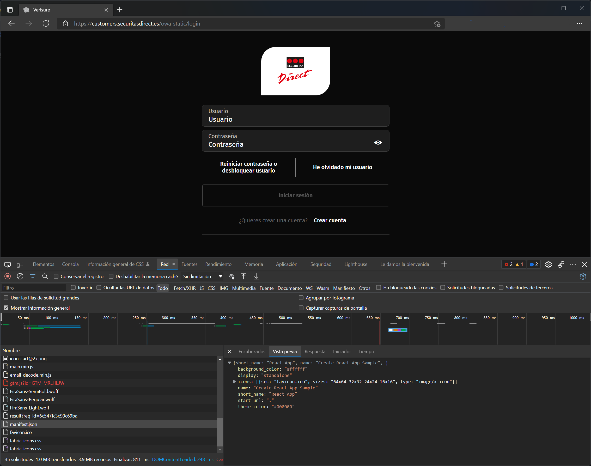

# How to capture the json request and json response payload from my browser.

If you want to contribute back to the project with new operations you may want to capture those operations in the browser.

Go to, [Securitas Direct customer web site](https://customers.securitasdirect.es/owa-static/login), open the Browser Dev Tools by pressing F12.

There you can capture the payload specified [here](new_operations.md).
