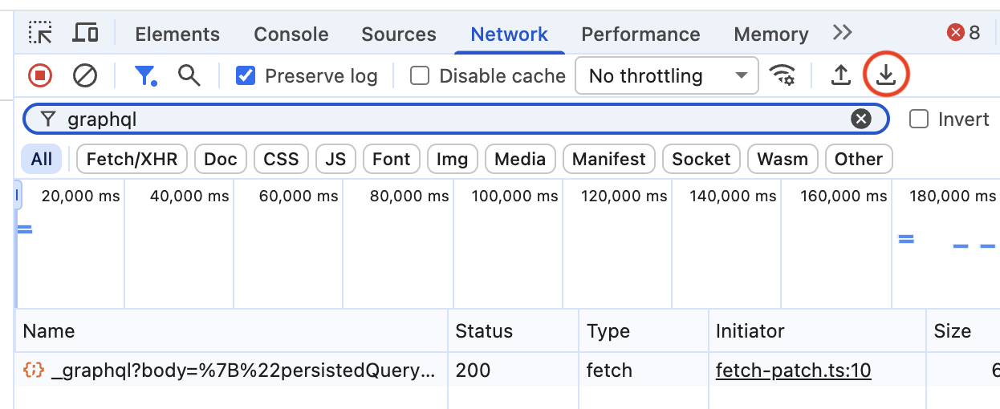
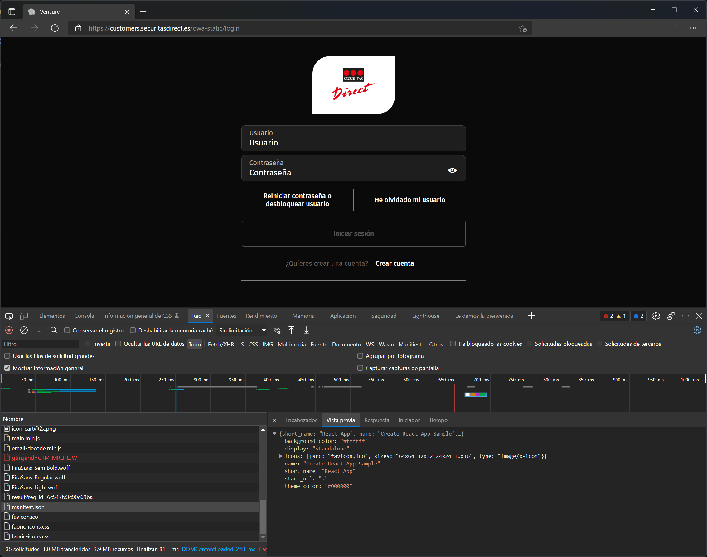

# How to Capture Browser Network Traffic

## HAR File of GraphQL Requests

When reporting an issue, it would be very helpful to include a HAR (HTTP Archive) file of the GraphQL requests sent by the Securitas website while you perform the task that is not working for you in Home Assistant, for instance setting the alarm, unlocking a lock, or taking a photograph with your camera.

To record the HAR file:

1. Log in to the [Securitas Direct customer web site](https://customers.securitasdirect.es/owa-static/login) in your browser.
2. Open **Developer Tools** (press **F12**, or **Ctrl+Shift+I** / **Cmd+Opt+I**, or use the browser menu → **More tools** → **Developer tools**).
3. Navigate to the **Network** tab.
4. Tick the **Preserve log** checkbox.
5. Filter on **graphql**.

6. Now carry out the actions you want to record.
7. Click the **Download** icon to download the HAR file.

> **WARNING**: The HAR file can contain sensitive or personal information. Either edit the file (it is just a JSON file) to remove that information, or ask for one of the developers' email addresses to send it directly to us.

## Capturing JSON Payloads for New Operations

If you want to contribute back to the project with new operations, you can capture those operations in the browser using the Developer Tools above.

You can capture the payload as specified [here](new_operations.md).
